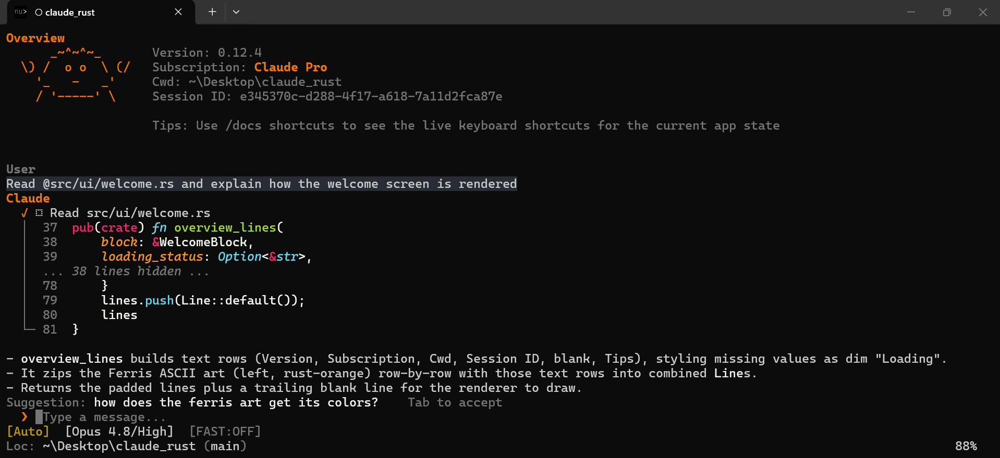

# Claude Code Rust

A native Rust terminal interface for Claude Code. Drop-in replacement for Anthropic's stock Node.js/React Ink TUI, built for performance and a better user experience.

[](https://www.npmjs.com/package/claude-code-rust)
[](https://www.npmjs.com/package/claude-code-rust)
[](https://github.com/srothgan/claude-code-rust/actions/workflows/pr.yml)
[](https://srothgan.github.io/claude-code-rust/)
[](https://www.apache.org/licenses/LICENSE-2.0)
[](https://nodejs.org/)

<p align="center">
  
</p>

## About

Claude Code Rust replaces the stock Claude Code terminal interface with a native Rust binary built on [Ratatui](https://ratatui.rs/). It connects to the same Claude API through a local Agent SDK bridge. Core Claude Code functionality - tool calls, file editing, terminal commands, and permissions - works unchanged.

## Requisites

- Node.js 18+ (for the Agent SDK bridge)
- Existing Claude Code authentication (`~/.claude/config.json`)

## Install

### npm (global, recommended)

```bash
npm install -g claude-code-rust
```

The npm package installs a small launcher plus a platform-specific optional dependency containing the prebuilt Rust binary for your OS and architecture.

If `claude-rs` reports a missing platform package, check whether optional dependencies were omitted:

```bash
npm config get omit
npm install -g claude-code-rust
```

If `claude-rs` resolves to an older global shim, ensure your npm global bin directory comes first on `PATH` or remove the stale shim before retrying.

## Usage

```bash
claude-rs
```

Full documentation is available at [srothgan.github.io/claude-code-rust](https://srothgan.github.io/claude-code-rust/).

> [!NOTE]
> **Agent SDK billing unchanged.** Anthropic has paused the previously announced Agent SDK credit change. For now nothing changes: Claude Agent SDK usage — including `claude -p` and third-party apps like this one — still draws from your normal Claude subscription limits. See [Use the Claude Agent SDK with your Claude plan](https://support.claude.com/en/articles/15036540-use-the-claude-agent-sdk-with-your-claude-plan).

## Why

The stock Claude Code TUI runs on Node.js with React Ink, which renders by redrawing full frames over raw ANSI escape codes. This causes real, widely-reported problems:

- **Flickering**: The whole view is redrawn on every status update, causing constant flicker — bad enough to crash editors' integrated terminals during long sessions
- **CPU**: Sustained high CPU even when idle, and runaway loops that spawn multiple background processes
- **Memory**: 200-400MB baseline (and climbing with conversation length) vs ~20-50MB for a native binary
- **Resize**: Window resizing leaves duplicated frames in scrollback, loses lines when shrinking, and can garble the display
- **Input latency**: Keystrokes echo with visible delay as context fills up, and noticeably worse on Windows
- **Scrollback**: Hijacks the terminal's native scrollback, erasing history you can no longer scroll back to
- **Paste**: Large pastes can flood stdout and freeze the terminal

Claude Code Rust addresses these by compiling to a single native binary with diffed, direct terminal control via Crossterm and Ratatui — no full-frame redraws, no Node runtime overhead.

## Documentation

The manual covers installation from npm and source, help, slash commands, keyboard shortcuts, settings, diagnostics, architecture, and the changelog:

- [Installation](https://srothgan.github.io/claude-code-rust/installation.html)
- [Usage](https://srothgan.github.io/claude-code-rust/usage.html)
- [Help](https://srothgan.github.io/claude-code-rust/help.html)
- [Slash commands](https://srothgan.github.io/claude-code-rust/commands.html)
- [Settings](https://srothgan.github.io/claude-code-rust/settings.html)

## Status

This project is pre-1.0 and under active development. See [CONTRIBUTING.md](CONTRIBUTING.md) for how to get involved.

## Limitations

Startup is still constrained by the upstream Claude Agent SDK runtime that this TUI wraps. The Rust interface itself is fast, but end-to-end readiness can still take noticeable time before a session is fully available. Improving that remains an active area of work.

## License

This project is licensed under the [Apache License 2.0](LICENSE). Apache-2.0 was chosen to keep usage and redistribution straightforward for individual users, downstream packagers, and commercial adopters.

## Disclaimer and Legal Notice

This project is not affiliated with, endorsed by, or supported by Anthropic.

A quick note on where this project stands, since I know people worry about this kind of thing: claude-code-rust is a terminal UI that I wrote from scratch in Rust. It is not a fork, copy or port of the latest Claude Code source leak -- it talks to Anthropic's official [Agent SDK](https://docs.anthropic.com/en/docs/agents-and-tools/claude-code/agent-sdk) as a runtime dependency instead, the same way any other third-party tool would. No Anthropic source code was read or used as reference at any point during development.

The project authenticates through your existing Claude Code account via the Agent SDK, and the Agent SDK's terms allow building on top of it. Billing, credits, limits, and overage behavior are controlled by Anthropic, including any future changes Anthropic may make to how Agent SDK usage is metered. Other community projects do the same. As far as I can tell, using this project is fine -- but I am a single maintainer, not a lawyer. If anything changes on Anthropic's end, I will update this section and adjust the project accordingly.

This project's source code is licensed under [Apache-2.0](LICENSE). The Agent SDK itself is proprietary and governed by [Anthropic's Commercial Terms of Service](https://www.anthropic.com/legal/commercial-terms).

For official Claude documentation, see [https://claude.ai/docs](https://claude.ai/docs).
